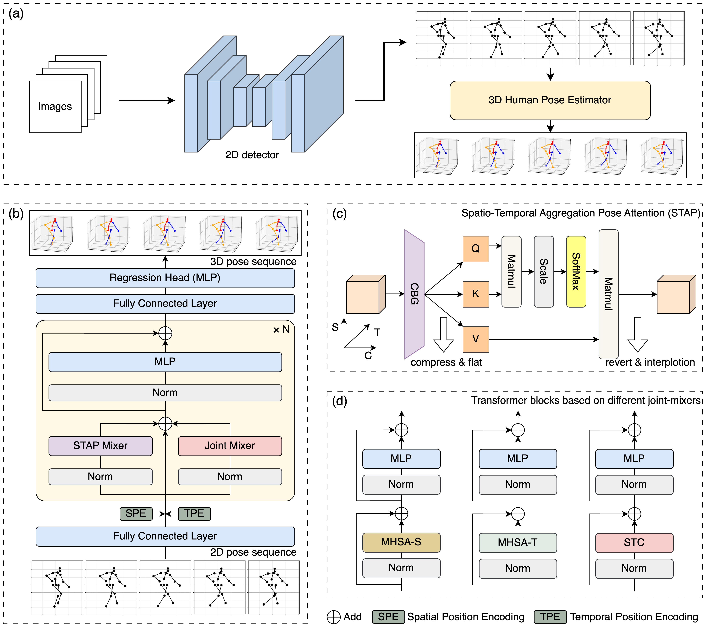

# STAPFormer

This is the official implementation for "[STAPFormer: STAPFormer: A New 3D Human Pose Estimation Framework in Sports and Health (ACM BCB 2024)](https://dl.acm.org/doi/10.1145/3698587.3701367)" on PyTorch platform.

<p align="center"></p>

## Dependencies

The project is developed under the following environment:

- python 3.8.10
- pytorch 2.0.0
- CUDA 12.2
- einops
- timm

## Dataset

The Human3.6M dataset setting follows the [MotionAGFormer](https://github.com/TaatiTeam/MotionAGFormer).
Please refer to it to set up the Human3.6M dataset (under ./data directory).

The MPI-INF-3DHP dataset setting follows the [P-STMO](https://github.com/paTRICK-swk/P-STMO).
Please refer it to set up the MPI-INF-3DHP dataset (also under ./data directory).

## Training from scratch

To train our model using the SH's 2D keypoints or Ground Truth (GT) 2D keypoints as inputs under 243 frames, please run:

```bash
python train.py --config configs/h36m/stapformer_base.yaml --checkpoint checkpoint/stapformer_base_h36m --log stapformer_base_h36m
```

To switch between CPN and GT keypoints, you only need to modify the use_proj_as_2d parameter in the corresponding configuration YAML file:

- Set use_proj_as_2d: True to use Ground Truth (GT) 2D keypoints.
- Set use_proj_as_2d: False (default) to use SH-generated 2D keypoints.

To train the model on the MPI dataset from scratch, please run:

```bash
python train_3dhp.py --config configs/mpi/stapformer_base.yaml --checkpoint checkpoint/stapformer_base_mpi --log stapformer_base_mpi
```

## Evaluating

| Method       | # frames  | # Params | # MACs         | H36M (SH) weights | H36M (GT) weights | MPI-INF-3DHP weights |
|--------------|-----------|----------|----------------|-------------------|-------------------|----------------------|
| STAPFormer-S |    243    |   4.0M   |      6.9G      |   [download]()    |   [download]()    |     [download]()     |
| STAPFormer   |    243    |  10.9M   |     18.0G      |   [download]()    |   [download]()    |     [download]()     |

To evaluate our model on Human3.6M, please run:

```bash
python train.py --config configs/h36m/stapformer_base.yaml --checkpoint checkpoint/stapformer_base_h36m --checkpoint_file ckpt.pth --eval_only
```

To evaluate our model on MPI-INF-3DHP, please run:

```bash
python train_3dhp.py --config configs/mpi/stapformer_base.yaml --checkpoint checkpoint/stapformer_base_mpi --checkpoint_file ckpt.pth --eval_only
```

and use the official script to calculate the evaluation metrics from the output results.

## Visualization

Please refer to the [MHFormer](https://github.com/Vegetebird/MHFormer).

## Citation

If you find this repo useful, please consider citing our paper:

```bibtex
@inproceedings{zhang2024stapformer,
  title={STAPFormer: A New 3D Human Pose Estimation Framework in Sports and Health},
  author={Zhang, Zhongteng and Peng, Qing and Zhang, Liu and Zhang, Zihao and Huang, Weihong},
  booktitle={Proceedings of the 15th ACM International Conference on Bioinformatics, Computational Biology and Health Informatics},
  pages={1--10},
  year={2024}
}
```

## Acknowledgement

Our code refers to the following repositories.

- [MotionAGFormer](https://github.com/TaatiTeam/MotionAGFormer)
- [MotionBERT](https://github.com/Walter0807/MotionBERT)
- [VideoPose3D](https://github.com/facebookresearch/VideoPose3D)
- [P-STMO](https://github.com/paTRICK-swk/P-STMO/tree/main)
- [MHFormer](https://github.com/Vegetebird/MHFormer)
- [MixSTE](https://github.com/JinluZhang1126/MixSTE)
- [STCFormer](https://github.com/zhenhuat/STCFormer)

We thank the authors for releasing their codes.
